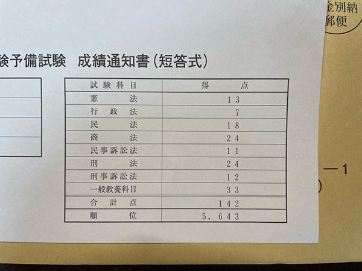

R5予備試験短答結果が届きました。

速報で採点は済んでいるので結果はわかっていましたが、採点していなかった一般教養が思ったより高かったため、トータルの点数は意図せず高かったです。こういうこともあるので最後まで諦めてはいけませんね。

昨年の短答終わってからは、論文の過去問講座を全部こなしたのち、短答過去問パーフェクトを購入して正答率の高い問題からこなしていっていたところで受験となりました。正答率75％以上の問題は2,3周こなせましたが、下4法は予備試験の問題が大半だからなのか正答率75％以上の問題が少なく網羅しきれなかったのが敗因の一つかなと思っています。正答率の低い問題も含めてもっと過去問をこなせば来年こそはいけるんではないかと思っています。とはいえ、相変わらず行政法弱いですね。

民法は一番問題も多くこなしており、それなりにやった感があったのですが、見事に打ち砕かれました。勉強不足です。

憲法は手応えがあったのですが、全くの勘違いでした。

昨年と違い、それなりに準備してのぞんだ試験でしたが見事に玉砕。想像以上に勉強が必要なことを痛感させられました。はっきりいって舐めていました。

昨年の短答が終わった時は「まぁ一年もあるし、大丈夫でしょ。」と思っていましたが、今は「一年じゃ時間が足りない。。。」と思う様になりました。やっと敵を知ったということでしょうか。もしかして思ってるよりもまだまだ壁は高いのでしょうか。とにかくやるしかないので、来年度の合格目指して、短答・論文頑張ります。